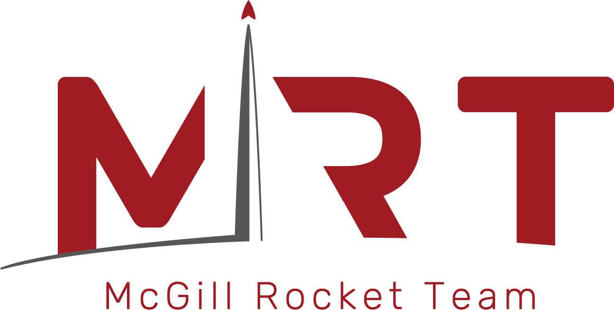

<div align="center">



# Steady-Unsteady

**Hybrid Rocket Engine Simulator — with a proper GUI.**

*A steady-state + transient simulation tool for the McGill Rocket Team's self-pressurising N₂O / paraffin hybrid.*

<br />

[](https://www.python.org/downloads/)
[](#-installation)
[](https://customtkinter.tomschimansky.com/)
[]()
[](https://www.mcgillrocketteam.com)

</div>

---

## ✨ What it does

- **Steady-state analysis** — hotfire, fuel-mass convergence, and multi-variable parametric sweeps.
- **Unsteady (transient) simulation** — full time-domain modelling of the tank, valve, injector, combustion chamber, nozzle, and full ascent trajectory.
- **Flight-trajectory prediction** — apogee, downrange, velocity, and Mach vs. time, with configurable parachute deployment.
- **Live results panels** — copy any result table straight to Google Sheets, or export to CSV with the correct units baked into every column header.
- **Unit-system switcher** — flip between **SI**, **Imperial**, and the McGill Rocket Team's mixed unit convention with one click; every value and unit label updates in place.
- **Validation & warnings** — physics-consistency checks flag any suspicious values before you trust a run.

---

## 📸 Screenshots

*(add screenshots to `docs/screenshots/` and reference them here)*

---

## 📋 Table of contents

- [Requirements](#-requirements)
- [Installation](#-installation)
- [Running the app](#-running-the-app)
- [Usage](#-usage)
- [Project layout](#-project-layout)
- [Troubleshooting](#-troubleshooting)

---

## 🔧 Requirements

| Requirement | Version | Notes |
| :--- | :--- | :--- |
| **[Python](https://www.python.org/downloads/)** | 3.13 | Earlier 3.10+ likely works but is untested. |
| **[Git](https://git-scm.com/downloads)** | any recent | For cloning the repository. |
| **[Microsoft C++ Build Tools](https://visualstudio.microsoft.com/visual-cpp-build-tools/)** | *(Windows only)* | Select **Desktop development with C++**, **MSVC v14.x**, and **Windows 10/11 SDK**. Needed because a couple of scientific-Python wheels compile from source on Windows. |

---

## 📦 Installation

Clone the repo and open a terminal in the project root (the folder that contains `requirements.txt`):

```bash
git clone https://github.com/Leo11235/MRT-Steady-Unsteady
cd MRT-Steady-Unsteady
```

<details>
<summary><b>Windows</b> — PowerShell or CMD</summary>

```powershell
py -3.13 -m venv .venv
Set-ExecutionPolicy -Scope CurrentUser -ExecutionPolicy RemoteSigned
.venv\Scripts\activate
python -m pip install -U pip setuptools wheel
python -m pip install -r requirements.txt
python -m pip install -r src\ui\requirements-ui.txt
```

</details>

<details>
<summary><b>macOS / Linux</b></summary>

```bash
python3.13 -m venv .venv
source .venv/bin/activate
python -m pip install -U pip setuptools wheel
python -m pip install -r requirements.txt
python -m pip install -r src/ui/requirements-ui.txt
```

</details>

> **Two requirements files?** `requirements.txt` covers the backend (NumPy, SciPy, matplotlib, CoolProp, …). `src/ui/requirements-ui.txt` adds the GUI-only dependencies (CustomTkinter, Pillow). Both are pinned for reproducibility.

---

## 🚀 Running the app

From the project root, with the virtual environment activated:

```bash
python -m src.ui.main
```

The GUI launches into full-screen mode on your primary display. From the Home screen you can:

- Configure and run a **Steady** simulation
- Configure and run an **Unsteady** simulation
- **Browse saved results** from previous runs
- **Report a bug** 🐌
- Open **Settings** (default unit system, results folder, etc.)

<details>
<summary><b>Subsequent sessions</b> (once the venv is set up)</summary>

```powershell
# Windows
.venv\Scripts\activate
python -m src.ui.main
```

```bash
# macOS / Linux
source .venv/bin/activate
python -m src.ui.main
```

</details>

---

## 🎯 Usage

### Running a simulation from the GUI

1. Pick **Steady** or **Unsteady** from the home screen.
2. Fill in the input tabs, or load a preset via **Load preset…**
3. Hit **Run simulation**. A pixel-rocket loading bar tracks progress; you can cancel at any time.
4. When it finishes, you land on the results page — a tabbed view of inputs, per-phase metrics, overall performance, warnings, and every plot the backend can generate.
5. Use the sidebar to **copy to clipboard**, **export to CSV**, or **display graphs**. Switch the sidebar's **SI / IMP / MRT** buttons to convert every value and unit label on the fly.

### Loading a saved run

From Home → **Browse saved results…**. Pick a `.json` result file; the same results page opens with that run's data. Useful for comparing runs or resharing outputs.

### Editing configurations directly

Every simulation configuration is stored as a `.jsonc` file under `user_data/simulation_configs/`. Copy `steady_input_template.jsonc` or `unsteady_input_template.jsonc`, edit in your favourite editor, then load via the GUI.

---

## 🗂️ Project layout

```
MRT-Steady-Unsteady/
├── src/
│   ├── backend/                   # Numerical solvers, physics, analysis
│   │   ├── steady/                # Steady-state simulator
│   │   └── unsteady/              # Transient simulator + control-volume models
│   └── ui/                        # GUI (CustomTkinter)
│       ├── app/                   # Pages, widgets, shell
│       ├── assets/                # Icons, logo
│       └── main.py                # ← `python -m src.ui.main` entry point
├── user_data/
│   ├── simulation_configs/        # Your input presets (.jsonc)
│   ├── simulation_results/        # Run outputs (.json)
│   └── ui_settings.json           # User preferences
├── requirements.txt               # Backend deps (NumPy, SciPy, matplotlib, ...)
└── src/ui/requirements-ui.txt     # GUI deps (CustomTkinter, Pillow)
```

---

## 🛠️ Troubleshooting

<details>
<summary><b><code>Set-ExecutionPolicy</code> error on Windows</b></summary>

If `.venv\Scripts\activate` refuses to run with an execution-policy error, run this once in your PowerShell:

```powershell
Set-ExecutionPolicy -Scope CurrentUser -ExecutionPolicy RemoteSigned
```

Then close and reopen the terminal.

</details>

<details>
<summary><b>SciPy / NumPy fail to install on Windows</b></summary>

Almost always missing C++ Build Tools. Install [Microsoft C++ Build Tools](https://visualstudio.microsoft.com/visual-cpp-build-tools/) with the **Desktop development with C++** workload, restart your terminal, then re-run the pip install.

</details>

<details>
<summary><b>The GUI opens off-screen / at a weird size</b></summary>

Delete `user_data/ui_settings.json` and relaunch — the file is regenerated with sensible defaults.

</details>

<details>
<summary><b>An error message during simulation</b></summary>

The error popup has a **Report a bug** button that pre-fills a bug report with the full terminal output, traceback, and the exact simulation inputs. That's the fastest way to send it upstream — no reproduction steps needed.

</details>

---

<div align="center">

Built by the **McGill Rocket Team**

<sub>Hybrid propulsion · Trajectory prediction · Test-data validation</sub>

</div>
