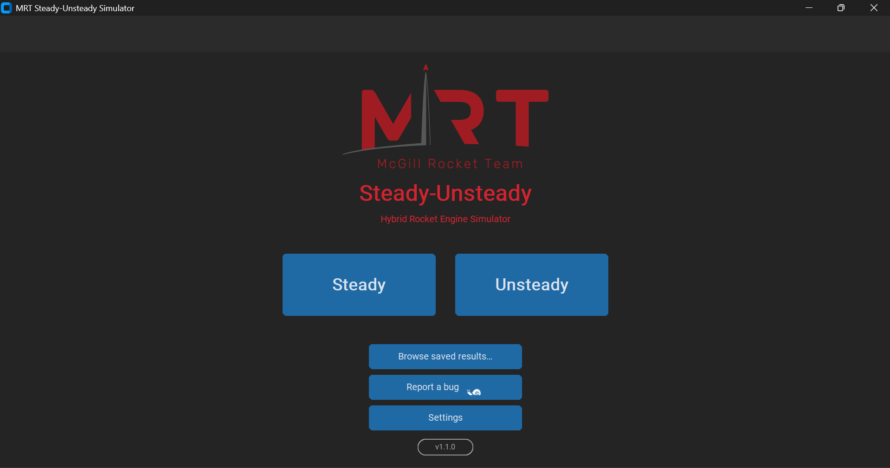
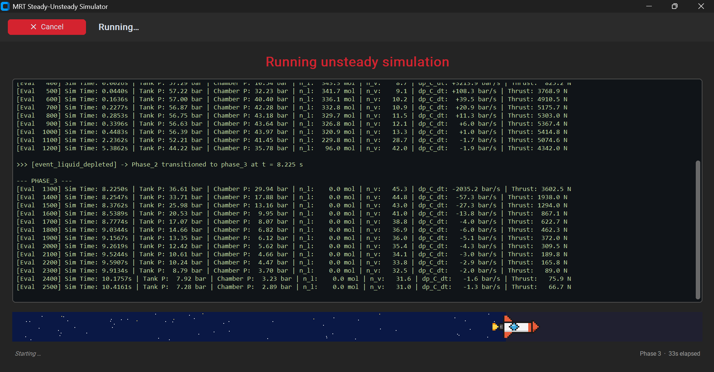
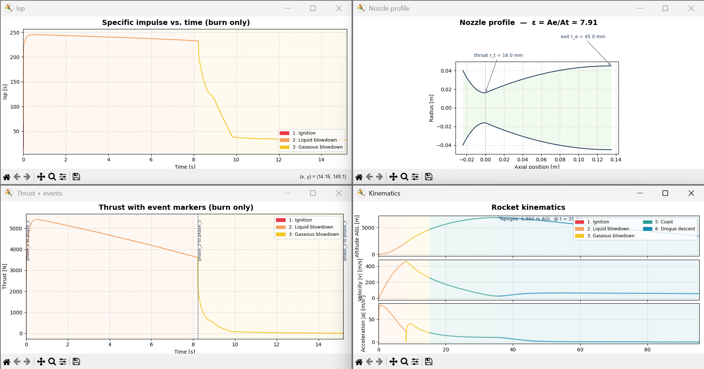

<div align="center">


# Steady-Unsteady

**Hybrid Rocket Engine Simulator, with a proper GUI.**

*A steady-state and transient simulation tool for the McGill Rocket Team's self-pressurising N₂O / paraffin hybrid.*

<br />

[](https://www.python.org/downloads/)
[](https://github.com/Leo11235/MRT-Steady-Unsteady/releases)
[](https://customtkinter.tomschimansky.com/)
[](https://github.com/Leo11235/MRT-Steady-Unsteady/releases)
[]()
[](https://www.mcgillrocketteam.com)

<br />



</div>

---

## What it does

- **Steady-state analysis** for hotfire, fuel-mass convergence, and multi-variable parametric sweeps.
- **Unsteady (transient) simulation** covering the full time-domain of the tank, valve, injector, combustion chamber, nozzle, and ascent trajectory.
- **Flight prediction** for apogee, downrange, velocity, and Mach vs. time, with configurable parachute deployment.
- **Live results panels** that copy any table straight to Google Sheets or export to CSV with the correct units baked into every column header.
- **Unit-system switcher** between SI, Imperial, and the McGill Rocket Team's mixed convention, converting every value and unit label in place.
- **Validation and warnings** that flag physically suspicious values before you trust a run.

---

## Download & install

Head to the [**Releases page**](https://github.com/Leo11235/MRT-Steady-Unsteady/releases), grab `MRT-Steady-Unsteady-Setup.exe` from the latest release, and double-click it. The installer walks through the rest.

If Windows shows a blue "Windows protected your PC," click **More info → Run anyway**. This only appears the first time.

Your presets, saved runs, and settings live in `%APPDATA%\MRT-Steady-Unsteady\` and are preserved across updates and reinstalls.

To run from source or contribute code, see [Development setup](#development-setup) below.

---

## Usage

### Running a simulation

1. Pick **Steady** or **Unsteady** from the home screen.
2. Fill in the input tabs, or click **Load preset...** to start from an example.
3. Click **Run simulation**. A pixel-rocket loading bar tracks progress and can be cancelled at any time.
4. When the run finishes, the results page opens automatically. It has tabbed panels for inputs, per-phase metrics, overall performance, warnings, and every plot the backend can generate.
5. Use the sidebar to copy results to the clipboard, export to CSV, or open the graphs window. The SI / IMP / MRT toggle in the sidebar converts every value and unit label on the fly.

<div align="center">

<br />
<sub><i>Loading screen while an unsteady run is in progress.</i></sub>
<br /><br />

<br />
<sub><i>Graphs window opened from the results page.</i></sub>
</div>

### Loading a saved run

From the home screen, click **Browse saved results...** and pick a `.json` result file. The results page opens with that run's data, useful for comparing runs or resharing outputs.

### Editing configurations directly

Every simulation configuration is stored as a `.jsonc` file under `user_data/simulation_configs/`. Copy any of `steady_example.jsonc`, `steady_parametric_example.jsonc`, or `unsteady_example.jsonc`, edit in your favourite editor, then load via the GUI.

---

## Reporting bugs

If a simulation errors out, click **Report a bug** on the error popup. The report is pre-filled with the terminal output, traceback, simulation inputs, and app version. Add a sentence about what you were doing and hit send. That's the fastest way to get a fix.

The bug reporter is also reachable from the home screen at any time.

---

## Development setup

Only needed if you're running from source or building the installer yourself.

### Requirements

| Requirement | Version | Notes |
| :--- | :--- | :--- |
| **[Python](https://www.python.org/downloads/)** | 3.13 | Earlier 3.10+ likely works but is untested. |
| **[Git](https://git-scm.com/downloads)** | any recent | For cloning the repository. |
| **[Microsoft C++ Build Tools](https://visualstudio.microsoft.com/visual-cpp-build-tools/)** | *(Windows only)* | Select **Desktop development with C++**, **MSVC v14.x**, and **Windows 10/11 SDK**. Needed because a couple of scientific-Python wheels compile from source on Windows. |
| **[Inno Setup 6](https://jrsoftware.org/isdl.php)** | *(only for building the installer)* | Not required for running from source. |

### Clone and install

Open a terminal in the project root (the folder that contains `requirements.txt`):

```bash
git clone https://github.com/Leo11235/MRT-Steady-Unsteady
cd MRT-Steady-Unsteady
```

<details>
<summary><b>Windows</b> (PowerShell or CMD)</summary>

```powershell
py -3.13 -m venv .venv
Set-ExecutionPolicy -Scope CurrentUser -ExecutionPolicy RemoteSigned
.venv\Scripts\activate
python -m pip install -U pip setuptools wheel
python -m pip install -r requirements.txt
python -m pip install -r src\ui\requirements-ui.txt
```

</details>

<details>
<summary><b>macOS / Linux</b></summary>

```bash
python3.13 -m venv .venv
source .venv/bin/activate
python -m pip install -U pip setuptools wheel
python -m pip install -r requirements.txt
python -m pip install -r src/ui/requirements-ui.txt
```

</details>

> **Two requirements files?** `requirements.txt` covers the backend (NumPy, SciPy, matplotlib, CoolProp, and friends). `src/ui/requirements-ui.txt` adds the GUI-only dependencies (CustomTkinter, Pillow). Both are pinned for reproducibility.

### Running from source

With the venv activated, from the project root:

```bash
python -m src.ui.main
```

The GUI launches full-screen on your primary display.

<details>
<summary><b>Subsequent sessions</b> (once the venv is set up)</summary>

```powershell
# Windows
.venv\Scripts\activate
python -m src.ui.main
```

```bash
# macOS / Linux
source .venv/bin/activate
python -m src.ui.main
```

</details>

### Building the installer

Bump `VERSION` in `src/ui/app/version.py` and `AppVersion` in `installer.iss` to the new release number. Then from the project root:

```powershell
.\build.bat
```

`build.bat` runs PyInstaller (using `src/ui/build.spec`) to produce `dist/MRT-Steady-Unsteady/`, then hands off to Inno Setup to package the folder into `Output/MRT-Steady-Unsteady-Setup.exe`. That final `.exe` is what you attach to a GitHub release.

---

## Project layout

```
MRT-Steady-Unsteady/
├── src/
│   ├── backend/
│   │   ├── common/                # Shared helpers (input normalizer, etc.)
│   │   ├── steady/                # Steady-state simulator
│   │   └── unsteady/              # Transient simulator + control-volume models
│   └── ui/
│       ├── app/                   # Pages, widgets, shell
│       ├── assets/                # Icons, logo
│       └── main.py                # `python -m src.ui.main` entry point
├── user_data/
│   ├── simulation_configs/        # Input presets (.jsonc)
│   ├── simulation_results/        # Run outputs (.json)
│   └── ui_settings.json           # Per-machine preferences
├── docs/                          # Screenshots and any extra docs
├── installer.iss                  # Inno Setup script
├── build.bat                      # PyInstaller + Inno Setup one-shot build
├── requirements.txt               # Backend dependencies
└── src/ui/requirements-ui.txt     # GUI dependencies
```

---

## Troubleshooting

<details>
<summary><b><code>Set-ExecutionPolicy</code> error on Windows</b></summary>

If `.venv\Scripts\activate` refuses to run with an execution-policy error, run this once in your PowerShell:

```powershell
Set-ExecutionPolicy -Scope CurrentUser -ExecutionPolicy RemoteSigned
```

Then close and reopen the terminal.

</details>

<details>
<summary><b>SciPy or NumPy fail to install on Windows</b></summary>

Almost always missing C++ Build Tools. Install [Microsoft C++ Build Tools](https://visualstudio.microsoft.com/visual-cpp-build-tools/) with the **Desktop development with C++** workload, restart your terminal, then re-run the pip install.

</details>

<details>
<summary><b>The GUI opens off-screen or at a weird size</b></summary>

Delete `user_data/ui_settings.json` (or `%APPDATA%\MRT-Steady-Unsteady\user_data\ui_settings.json` if you're on the installed build) and relaunch. The file is regenerated with sensible defaults.

</details>

<details>
<summary><b>Windows SmartScreen warning on the installer</b></summary>

The setup `.exe` isn't code-signed. Click **More info → Run anyway** on the SmartScreen dialog. Only appears the first time you install a given version.

</details>

---

<div align="center">

Built by the **McGill Rocket Team**

</div>